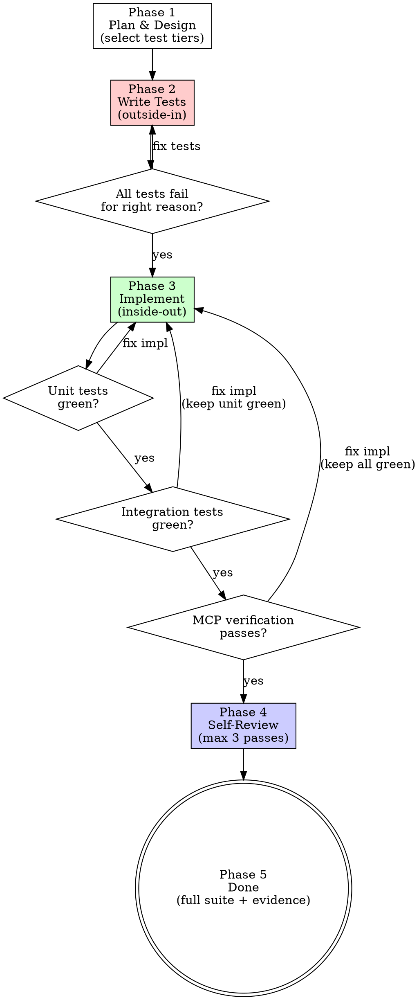

# TDD Workflow

## Overview

Project-specific test-driven development process for Streamline-Bridge. Defines **what** to test (three tiers), **when** to test (outside-in writing, inside-out implementation), and **how** to verify (including Claude-driven MCP scenarios).

**REQUIRED BACKGROUND:** You MUST follow `superpowers:test-driven-development` for core red-green-refactor discipline. This skill does not replace it — it layers project-specific process on top.

## Test Tiers

Select during planning. Not every change needs all three. Zero tiers is valid for pure doc/config changes (still run `flutter analyze`).

| Tier | What it tests | Runner | Mock boundary |
|------|--------------|--------|---------------|
| **Unit** | Single controller, model, DAO, handler | `flutter test` | Direct collaborators mocked |
| **Integration** | Multi-component flows (e.g., BLE scan → ConnectionManager → ScaleController → weight) | `flutter test` (same runner) | Only hardware/transport edge mocked (use TestScale, MockDeviceDiscoveryService, in-memory Drift) |
| **MCP verification** | API surface, WebSocket streams, end-to-end through running app | Claude-driven via MCP tools | App runs in simulate mode (MockDe1, MockScale) |

**Integration tests live in `test/` alongside unit tests.** No `integration_test/` directory. The difference is what they wire up — integration tests instantiate multiple real collaborators.

## Process



### Phase 1 — Plan & Design

1. Explore codebase, understand the problem.
2. Design solution approach.
3. **Decide which test tiers apply** to this change.
4. Sketch what tests will verify — behaviors and assertions, not full code.
5. Present plan for user review. Iterate until accepted.

### Phase 2 — Write Tests (outside-in)

Write tests in this order — API surface down to unit level:

1. **MCP scenario** (if applicable): Write structured YAML in `test/mcp_scenarios/`. See MCP Verification section below.
2. **Integration tests** (if applicable): Wire real controllers with mock transport boundaries.
3. **Unit tests**: Isolated, one behavior per test.

Then verify all tests fail for the right reason. Apply `superpowers:test-driven-development` RED discipline — if a test passes immediately, it's testing existing behavior, fix it.

### Phase 3 — Implement (inside-out)

Build from core outward:

1. Write minimal code to make **unit tests** pass. Run `flutter analyze`.
2. Run **integration tests**. If failing: fix implementation (not tests), re-confirm unit tests green.
3. Run **MCP verification**. If failing: fix implementation, re-confirm unit + integration green.

**Key invariant:** Tests written in Phase 2 do not change during implementation. If a test is wrong, that's a planning error — go back to Phase 1.

### Phase 4 — Self-Review (1-3 passes)

After all tiers are green:

1. Review own code for readability, DRY, SRP.
2. Make improvements.
3. **Re-run all tests** after every change. If anything breaks, fix before continuing.
4. Stop after 1 pass if clean. Max 3 passes total.

### Phase 5 — Done

1. Run full `flutter test` + `flutter analyze`.
2. Run all MCP scenarios in `test/mcp_scenarios/` (regression check).
3. Report completion with evidence — test output and MCP results.

## MCP Verification

### Scenario Format

Location: `test/mcp_scenarios/{feature-or-flow-name}.yaml`

```yaml
name: scale-connection-weight-flow
description: Verify scale discovery, connection, and weight measurement through API

preconditions:
  app_start:
    connectDevice: MockDe1
    connectScale: MockScale

steps:
  - tool: devices_list
    expect:
      status: 200
      body_contains:
        - MockScale

  - tool: machine_get_state
    expect:
      status: 200

  - tool: scale_tare
    expect:
      status: 200

postconditions:
  - app_stop
```

### Execution Protocol

1. Read scenario file.
2. Execute preconditions (typically `app_start` with simulate mode).
3. Execute each step: call MCP tool, compare response to `expect`.
4. On failure: report step number, expected vs actual, stop.
5. On success: execute postconditions, report all steps passed.

### Regression

When verifying a new feature, also run existing scenarios in `test/mcp_scenarios/` to catch regressions. Report any failures from existing scenarios separately.

## Tier Selection Guide

| Change type | Unit | Integration | MCP |
|------------|------|-------------|-----|
| Model/DAO logic | Yes | Rarely | No |
| Single controller behavior | Yes | No | No |
| Multi-controller flow | Yes | Yes | Maybe |
| REST/WebSocket endpoint | Yes | No | Yes |
| Full-stack feature (UI + API) | Yes | Yes | Yes |
| Pure documentation/config | No | No | No (run `flutter analyze`) |
| API spec / plugin manifest | No | No | Yes |

## Common Mistakes

| Mistake | Fix |
|---------|-----|
| Writing implementation before tests | Delete it. Follow `superpowers:test-driven-development` Iron Law. |
| Modifying tests to match implementation | Tests reflect requirements, not implementation. Go back to planning. |
| Skipping MCP verification "because unit tests pass" | Unit tests don't cover the API surface. If MCP tier was selected, run it. |
| Running only new MCP scenario, skipping existing ones | Always run full `test/mcp_scenarios/` for regression. |
| Self-review exceeds 3 passes | Diminishing returns. Stop and ship. |
| Skipping `flutter analyze` | Run it. Every time. Non-negotiable. |
