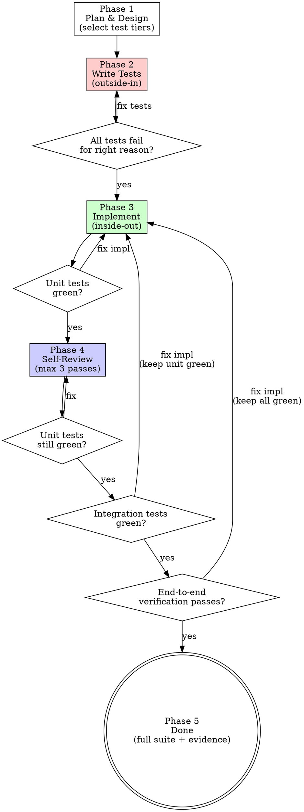

# TDD Workflow

## Overview

Project-specific test-driven development process for Streamline-Bridge. Defines **what** to test (three tiers), **when** to test (outside-in writing, inside-out implementation), and **how** to verify (including end-to-end smoke tests against a running app via `scripts/sb-dev.sh`).

**REQUIRED BACKGROUND:** You MUST follow `superpowers:test-driven-development` for core red-green-refactor discipline. This skill does not replace it — it layers project-specific process on top.

## Test Tiers

Select during planning. Not every change needs all three. Zero tiers is valid for pure doc/config changes (still run `flutter analyze`).

| Tier | What it tests | Runner | Mock boundary |
|------|--------------|--------|---------------|
| **Unit** | Single controller, model, DAO, handler | `flutter test` | Direct collaborators mocked |
| **Integration** | Multi-component flows (e.g., BLE scan → ConnectionManager → ScaleController → weight) | `flutter test` (same runner) | Only hardware/transport edge mocked (use TestScale, MockDeviceDiscoveryService, in-memory Drift) |
| **End-to-end** | API surface, WebSocket streams, full-stack through running app | `scripts/sb-dev.sh` + `curl` / `websocat` | App runs in simulate mode (MockDe1, MockScale) |

**Integration tests live in `test/` alongside unit tests.** No `integration_test/` directory. The difference is what they wire up — integration tests instantiate multiple real collaborators.

## Process

### Phase 1 — Plan & Design

1. Explore codebase, understand the problem.
2. Design solution approach.
3. **Decide which test tiers apply** to this change.
4. Sketch what tests will verify — behaviors and assertions, not full code.
5. Present plan for user review. Iterate until accepted.

### Phase 2 — Write Tests (outside-in)

Write tests in this order — API surface down to unit level:

1. **End-to-end recipe** (if applicable): Write a markdown scenario under `.agents/skills/streamline-bridge/scenarios/` — preconditions, `curl` / `websocat` commands, expected output hints, postconditions. Mirror the existing recipes (`build-info.md`, `display-brightness.md`, etc).
2. **Integration tests** (if applicable): Wire real controllers with mock transport boundaries.
3. **Unit tests**: Isolated, one behavior per test.

Then verify all tests fail for the right reason. Apply `superpowers:test-driven-development` RED discipline — if a test passes immediately, it's testing existing behavior, fix it.

### Phase 3 — Implement (inside-out, unit level)

1. Write minimal code to make **unit tests** pass. Run `flutter analyze`.

**Key invariant:** Tests written in Phase 2 do not change during implementation. If a test is wrong, that's a planning error — go back to Phase 1.

### Phase 4 — Self-Review (1-3 passes)

After unit tests are green, before moving to integration / end-to-end:

1. Review own code for readability, DRY, SRP.
2. Make improvements.
3. **Re-run unit tests** after every change. If anything breaks, fix before continuing.
4. Stop when a review pass finds nothing to improve.

Clean code foundation before building upward — integration and end-to-end layers should build on refined code.

### Phase 5 — Integration & End-to-end Verification

1. Run **integration tests** via `flutter test`. If failing: fix implementation (not tests), re-confirm unit tests green.
2. Run the **end-to-end scenario(s)** via `scripts/sb-dev.sh` + `curl` / `websocat`. If failing: fix implementation, re-confirm unit + integration green.

### Phase 6 — Done

1. Run full `flutter test` + `flutter analyze`.
2. Walk the related end-to-end scenarios under `.agents/skills/streamline-bridge/scenarios/` as a regression check.
3. Report completion with evidence — test output and curl/websocat results.

## End-to-end Verification

See `.agents/skills/streamline-bridge/verification.md` for the full verification protocol and `.agents/skills/streamline-bridge/scenarios/` for concrete, reproducible recipes. Summary:

1. **Boot** — `scripts/sb-dev.sh start --connect-machine MockDe1 --connect-scale MockScale`.
2. **Exercise** — walk the scenario steps (`curl` for REST, `websocat` for WebSocket). Each recipe file lists expected output hints; use `jq -e` predicates for one-shot assertions where it makes sense.
3. **Reload** — `scripts/sb-dev.sh reload` after each Dart edit so the next call hits the new code.
4. **Stop** — `scripts/sb-dev.sh stop`.

Scenario files live as markdown, not YAML — they're written to be pasted into a shell verbatim. When verifying a new feature that lives end-to-end, also walk any existing recipe that exercises the surrounding area to catch regressions.

## Tier Selection Guide

| Change type | Unit | Integration | End-to-end |
|------------|------|-------------|-----------|
| Model/DAO logic | Yes | Rarely | No |
| Single controller behavior | Yes | No | No |
| Multi-controller flow | Yes | Yes | Maybe |
| REST/WebSocket endpoint | Yes | No | Yes |
| Full-stack feature (UI + API) | Yes | Yes | Yes |
| Pure documentation/config | No | No | No (run `flutter analyze`) |
| API spec / plugin manifest | No | No | Yes |

## Common Mistakes

| Mistake | Fix |
|---------|-----|
| Writing implementation before tests | Delete it. Follow `superpowers:test-driven-development` Iron Law. |
| Modifying tests to match implementation | Tests reflect requirements, not implementation. Go back to planning. |
| Skipping end-to-end verification "because unit tests pass" | Unit tests don't cover the REST/WebSocket surface. If the end-to-end tier was selected, run it. |
| Running only the new scenario, skipping existing ones | Also walk neighbouring recipes under `.agents/skills/streamline-bridge/scenarios/` as regression. |
| Self-review keeps cycling without finding improvements | Stop when a pass finds nothing to change. |
| Skipping `flutter analyze` | Run it. Every time. Non-negotiable. |
