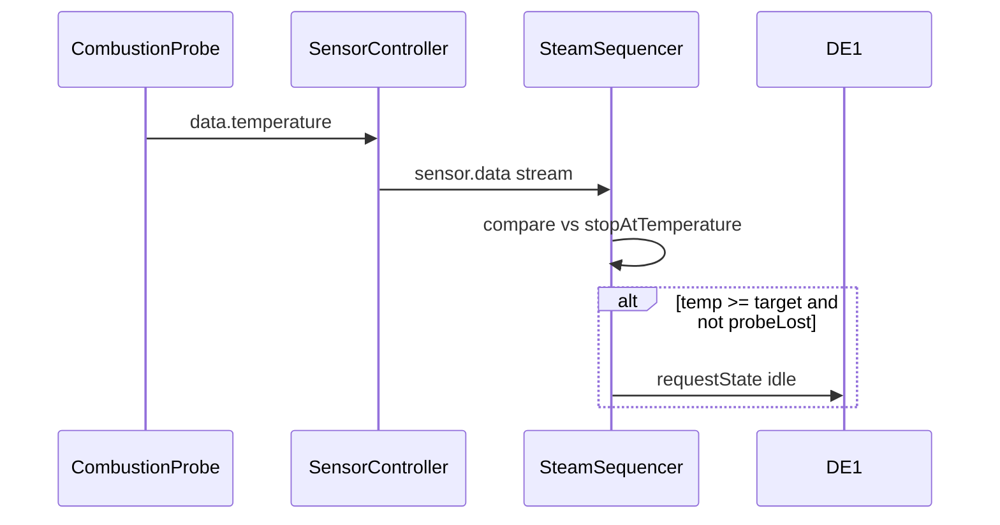
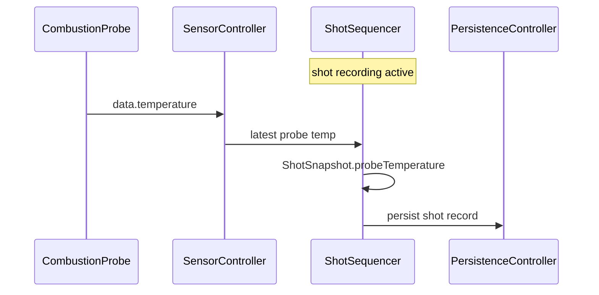

# Combustion Inc Probe — Engineering Implementation Handoff

Engineering handoff to produce a detailed engineering spec and implementation plan for the Combustion Inc Predictive Thermometer integration in Decent.app.

**Product requirements:** [PRD.md](PRD.md)

**Phase 0 spike template:** [SPIKE-universal-ble-discovery.md](SPIKE-universal-ble-discovery.md)

Assumes familiarity with [`CLAUDE.md`](../../CLAUDE.md), [TDD workflow](.claude/skills/tdd-workflow/SKILL.md), and [dev-loop verification](.agents/skills/decent-app/verification.md).

---

## 1. Purpose and audience

This document describes **how** to implement the Combustion probe integration. It does not include time estimates — engineering derives scheduling from the numbered sequence in [§13](#13-tdd-implementation-sequence).

Audience: engineers producing the engineering spec, task breakdown, and implementation PRs.

---

## 2. Reference materials

### External (Combustion)

| Source | Use |
|--------|-----|
| [probe_ble_specification.rst](https://github.com/combustion-inc/combustion-documentation/blob/main/probe_ble_specification.rst) | Protocol authority (DRAFT) |
| [combustion-android-ble](https://github.com/combustion-inc/combustion-android-ble) — `ProbeScanner` | Advertising parse reference |
| [combustion-ios-ble](https://github.com/combustion-inc/combustion-ios-ble) | Alternative parse reference |
| [combustion.inc/pages/developer](https://combustion.inc/pages/developer) | Links to frameworks and examples |

### In-repo code templates

| File | Use |
|------|-----|
| [`lib/src/models/device/impl/decent_temp/temperature.dart`](../../lib/src/models/device/impl/decent_temp/temperature.dart) | Simple GATT sensor — subscribe → emit `{temperature}` |
| [`lib/src/models/device/impl/difluid/difluid_r2_sensor.dart`](../../lib/src/models/device/impl/difluid/difluid_r2_sensor.dart) | Rich sensor — multi-channel `data`, `SensorInfo`, commands |
| [`lib/src/controllers/steam_sequencer.dart`](../../lib/src/controllers/steam_sequencer.dart) | Stop-at-temp consumer |
| [`lib/src/controllers/sensor_controller.dart`](../../lib/src/controllers/sensor_controller.dart) | Sensor registry (discovered + bridge) |
| [`lib/src/services/device_matcher.dart`](../../lib/src/services/device_matcher.dart) | Name-based matching today |
| [`lib/src/services/universal_ble_discovery_service.dart`](../../lib/src/services/universal_ble_discovery_service.dart) | Discovery — empty-name early return at line 199–200 |
| [`lib/src/services/webserver/sensors_handler.dart`](../../lib/src/services/webserver/sensors_handler.dart) | REST + WS sensor API |

### Archived plans (lessons applied)

| Plan | Lesson for Combustion |
|------|----------------------|
| [Bengle milk-probe + Steam Sequencer](../archive/bengle-milk-probe-and-steam-sequencer/2026-05-18-bengle-milk-probe-and-steam-sequencer.md) | Direct predecessor; TDD sequence; E2E scenario; OpenAPI same commit |
| [BLE scan refactor](../archive/ble-scan-refactor/2026-02-23-ble-scan-refactor-design.md) | Two-phase discovery; scan-response UUIDs; unfiltered scan + metadata match |
| [Hot-water stop-at-weight](../archive/hot-water-stop-at-weight/design.md) | Pure decision logic; gateway mode `full` → sequencer inert |
| [Shot-scale-disconnect](../archive/shot-scale-disconnect/2026-04-06-shot-scale-disconnect.md) | `_scaleLost` / disconnect-mid-session pattern |
| [Acaia scale fix](../archive/acaia-scale-fix/2025-03-25-acaia-scale-fix-design.md) | Multiple identification paths |
| [TDD workflow design](../archive/tdd-workflow/2026-03-12-tdd-workflow-design.md) | Test tier selection |
| [Android ANR fix](../archive/android-anr-fix/fix-android-anr.md) | BLE congestion during wake — prefer adv-only |
| [Transport lifetime audit](../archive/transport-lifetime-audit/transport-lifetime-audit.md) | Idempotent GATT subscribe if GATT added later |

---

## 3. Phase 0 — Engineering spike (blocking)

**Do not start feature code until Phase 0 is complete.** Use [SPIKE-universal-ble-discovery.md](SPIKE-universal-ble-discovery.md).

Investigations:

1. Confirm `universal_ble` `BleDevice` exposes `manufacturerData`, `manufacturerIds`, and/or `serviceUuids` on **Android DE1 tablet** (primary platform).
2. Capture 2–3 real Combustion advertisement payloads — store hex fixtures in `test/fixtures/combustion/`.
3. Determine whether Probe Status UUID appears in primary advertisement vs scan response ([ble-scan-refactor lesson](../archive/ble-scan-refactor/2026-02-23-ble-scan-refactor-design.md)).
4. Document decision: advertising-only feasible with current stack, or `universal_ble` fork/PR required.

**Deliverable:** Completed spike doc with go/no-go for adv-only MVP.

---

## 4. Combustion protocol notes

### 4.1 Identification

| Constant | Value |
|----------|-------|
| Manufacturer company ID | `0x09C7` |
| Probe Status service | `00000100-CAAB-3792-3D44-97AE51C1407A` |
| Probe Status characteristic (notify) | `00000101-CAAB-3792-3D44-97AE51C1407A` |
| Nordic UART (optional) | `6E400001-B5A3-F393-E0A9-E50E24DCCA9E` |

Advertised name is typically **serial number**, not `"Combustion …"`.

### 4.2 Temperature decode

- Parse 13-byte packed thermistor field from advertising or Probe Status notification
- Formula: `celsius = (raw13bit × 0.05) − 20`
- Range: −20 to 369 °C
- Expose virtual core, surface, ambient when present in payload
- Handle Instant Read mode (faster advertising interval, consolidated reading)

### 4.3 Connection modes

| Mode | Pros | Cons | MVP? |
|------|------|------|------|
| **Advertising-only** | No connection slot; matches official `ProbeScanner` | Requires discovery refactor; may need mfg data from scan | **Recommended v1** |
| GATT connected | Fits `DecentTemp` pattern; notify stream | Uses probe connection slot; competes with Combustion app/Display | Deferred |

Probe supports max **3 simultaneous BLE connections**. DE1 tablet already holds machine + scale. Advertising-only avoids consuming a probe slot.

---

## 5. Architecture

### 5.1 New files (proposed)

```
lib/src/models/device/impl/combustion/
  combustion_constants.dart      # UUIDs, vendor ID, channel IDs
  combustion_protocol.dart       # Pure Dart parse/decode (testable)
  combustion_probe.dart          # Sensor implementation
  mock_combustion_probe.dart     # Simulate mode

test/fixtures/combustion/        # Hex adv payloads from Phase 0 spike
test/models/device/impl/combustion/
  combustion_protocol_test.dart
  combustion_probe_test.dart
test/integration/
  combustion_steam_stop_integration_test.dart
  combustion_shot_probe_integration_test.dart   # Phase 3

.agents/skills/decent-app/scenarios/
  combustion-probe-steam-stop.md                # E2E recipe
```

### 5.2 Modified files by phase

**Phase 1 — Driver + discovery + steam**

| File | Change |
|------|--------|
| [`device_matcher.dart`](../../lib/src/services/device_matcher.dart) | Add Combustion to `serviceUuidsFor(sensor)`; `matchFromScanMetadata()` |
| [`universal_ble_discovery_service.dart`](../../lib/src/services/universal_ble_discovery_service.dart) | Pass scan metadata; allow empty-name Combustion match |
| [`simulated_device_service.dart`](../../lib/src/services/simulated_device_service.dart) | Mock Combustion in simulate types |
| [`main.dart`](../../lib/main.dart) | Wire simulate Combustion if applicable |
| Settings service | `preferredSteamProbeId`, `preferredShotProbeId`, `combustionDefaultChannel` |
| [`steam_sequencer.dart`](../../lib/src/controllers/steam_sequencer.dart) | Preferred probe + `_probeLost`; optional gateway gate (OD-6) |
| [`sensor_controller.dart`](../../lib/src/controllers/sensor_controller.dart) | `resolvePreferred(String? id)` |
| [`doc/DeviceManagement.md`](../../doc/DeviceManagement.md) | Combustion discovery + sensor precedence |

**Phase 2 — Live brew (documentation)**

| File | Change |
|------|--------|
| [`doc/Api.md`](../../doc/Api.md) | Document skin use of `/ws/v1/sensors/{id}/snapshot` during shots |

**Phase 3 — Shot persistence + UI**

| File | Change |
|------|--------|
| [`shot_snapshot.dart`](../../lib/src/models/data/shot_snapshot.dart) | `probeTemperature?` |
| [`shot_sequencer.dart`](../../lib/src/controllers/shot_sequencer.dart) | Sensor subscription + `_probeLost` |
| Drift shot tables / DAO / mapper | Nullable `probeTemperature` column |
| [`realtime_shot_feature/`](../../lib/src/realtime_shot_feature/) | Live + recorded probe temp display |
| [`steam_form.dart`](../../lib/src/home_feature/forms/steam_form.dart) | `stopAtTemperature` field |
| [`assets/api/rest_v1.yml`](../../assets/api/rest_v1.yml) | `ShotSnapshot.probeTemperature` |
| [`doc/Api.md`](../../doc/Api.md) | New fields |

---

## 6. Component specifications

### 6.1 `CombustionProtocol` (pure Dart)

**Input:** Raw advertising bytes or Probe Status notification bytes.

**Output:** `CombustionReading` with timestamp, raw T1–T8, optional virtual core/surface/ambient.

**Requirements:**

- No I/O — fully unit-testable
- Fixtures from Phase 0 hardware capture in `test/fixtures/combustion/`
- CRC / validation per spec where applicable
- Optional: pure `shouldStopSteam({required double temp, required double target})` mirroring [hot-water-stop](../archive/hot-water-stop-at-weight/design.md) decision-table style

### 6.2 `CombustionProbe implements Sensor`

```dart
class CombustionProbe implements Sensor {
  static final BleServiceIdentifier serviceIdentifier = ...;
  static const int manufacturerId = 0x09C7;

  CombustionProbe({required BLETransport transport});
}
```

**`onConnect()` — advertising-only (v1):**

- Register for ongoing scan/advertisement updates on transport
- Parse via `CombustionProtocol`; emit on `_data` BehaviorSubject
- Do not open GATT connection unless spike proves adv-only insufficient

**`data` payload minimum:**

```json
{ "temperature": 62.5, "timestamp": "2026-06-30T12:00:00.000Z" }
```

**`SensorInfo`:** Declare `temperature` plus extended channels (core, surface, ambient, T1–T8) for API consumers.

**`execute()`:** `UnimplementedError` or stub until UART commands are in scope.

### 6.3 Discovery — two-phase model

Aligned with [ble-scan-refactor](../archive/ble-scan-refactor/2026-02-23-ble-scan-refactor-design.md).

**Current blocker** in `universal_ble_discovery_service.dart`:

```dart
final name = device.name ?? '';
if (name.isEmpty) return;
```

**Phase 1 — Scan (no connection):**

1. Unfiltered scan continues (existing post-refactor approach).
2. Build scan metadata per device: `{ name, manufacturerData, serviceUuids }`.
3. Call `DeviceMatcher.matchFromScanMetadata(...)`:
   - Existing name rules first.
   - Fallback: manufacturer ID `0x09C7` OR Probe Status UUID in primary adv **or** scan response.
4. Add matched `CombustionProbe` to discovery list without connecting.
5. Add Combustion UUID to `serviceUuidsFor(DeviceType.sensor)` for filtered-scan supplement (Android throttling bypass — not sole path).

**Phase 2 — Connect (`SensorController._processDevices` → `onConnect()`):**

- Adv-only: start adv listener; soft-verify packets parse.
- GATT (deferred): `BleServiceIdentifier.matchesAny()` in `onConnect()` like `DecentTemp`.

**API design:** Add `matchFromScanMetadata` rather than overloading `match(advertisedName)` — preserves existing matchers ([acaia lesson](../archive/acaia-scale-fix/2025-03-25-acaia-scale-fix-design.md)).

**Concurrency:** Respect `ScanStateGuardian` / `_isScanning` — no overlapping scans ([comms-harden phase 3](../archive/comms-harden/comms-phase-3.md)).

### 6.4 `SteamSequencer` integration (Phase 1)

Existing app-side stop at [`steam_sequencer.dart:151-172`](../../lib/src/controllers/steam_sequencer.dart):

```dart
void _maybeAppSideStop(MachineSnapshot s) {
  // ... compares _latestSensorTemperature vs stopAtTemperature
  machine.requestState(MachineState.idle);
}
```

**Required changes (Phase 1, not deferred):**

1. Replace `_trackFirstSensor()` with `SensorController.resolvePreferred(preferredSteamProbeId)`.
2. Add `_probeLost` + `sensor.connectionState` listener during open steam record:
   - On disconnect: set `_probeLost = true`, log warning, disable app-side stop
   - Pattern from [shot-scale-disconnect](../archive/shot-scale-disconnect/2026-04-06-shot-scale-disconnect.md)
3. Resolve PRD OD-6: optionally gate `_maybeAppSideStop` when `gatewayMode == full` ([hot-water-stop](../archive/hot-water-stop-at-weight/design.md) precedent).

Extend [`test/controllers/steam_sequencer_test.dart`](../../test/controllers/steam_sequencer_test.dart).

### 6.5 `ShotSequencer` integration (Phase 3)

Mirror steam pattern with disconnect safety:

1. On shot open: resolve preferred sensor via `SensorController.resolvePreferred(preferredShotProbeId)`.
2. Subscribe to `sensor.data`; track `_latestProbeTemperature`.
3. Monitor `sensor.connectionState` → `_probeLost` on disconnect mid-shot.
4. Each `ShotSnapshot`: use last-known `probeTemperature` for history continuity (PRD FR-B3a); stop-at-weight unaffected.
5. On shot close: cancel subscriptions.

New tests mirroring shot-scale-disconnect scenarios.

### 6.6 Preferred probe selection (Phase 1 minimum)

Supersedes Bengle plan deferral of `stopSourceId`.

**Settings keys:**

- `preferredSteamProbeId` (nullable string)
- `preferredShotProbeId` (nullable string)
- `combustionDefaultChannel` (enum or string — resolves OD-1/OD-2)

**`SensorController.resolvePreferred(String? id)` precedence:**

1. Bridge-registered sensor with matching `deviceId` (Bengle milk probe wins on collision)
2. Explicit preferred ID if set and sensor connected
3. First registered discovered sensor (legacy fallback)

Document in [`doc/DeviceManagement.md`](../../doc/DeviceManagement.md).

---

## 7. Data flows

### 7.1 Steam stop-at-temperature



### 7.2 Shot probe recording



---

## 8. API surface impact

| Endpoint | Change |
|----------|--------|
| `GET /api/v1/sensors` | Lists Combustion when connected |
| `GET /api/v1/sensors/{id}` | Combustion `SensorInfo` with extended channels |
| `GET /ws/v1/sensors/{id}/snapshot` | Streams Combustion readings (no change) |
| Shot REST endpoints | `probeTemperature` in snapshot JSON (Phase 3) |
| Workflow `steamSettings.stopAtTemperature` | No schema change (exists) |

**Hard gate:** Update [`assets/api/rest_v1.yml`](../../assets/api/rest_v1.yml) and [`doc/Api.md`](../../doc/Api.md) in the **same commit** as schema changes ([Bengle plan precedent](../archive/bengle-milk-probe-and-steam-sequencer/2026-05-18-bengle-milk-probe-and-steam-sequencer.md)).

---

## 9. Testing strategy

| Tier | Scope | Key tests |
|------|-------|-----------|
| Unit | `combustion_protocol.dart` | Fixture parse, edge temps, corrupt packets |
| Unit | `CombustionProbe` | Mock transport adv → `data` stream |
| Unit | `DeviceMatcher.matchFromScanMetadata` | Mfg ID, service UUID in scan response, serial name, empty name + mfg |
| Unit | `SteamSequencer` | App-side stop; `_probeLost`; preferred probe |
| Unit | `ShotSequencer` | Probe temp populated; disconnect mid-shot |
| Integration | Full steam session | MockCombustion + SteamSequencer + PersistenceController |
| E2E | `sb-dev` + scenario | [combustion-probe-steam-stop.md](.agents/skills/decent-app/scenarios/combustion-probe-steam-stop.md) |
| Hardware | Android DE1 tablet | DE1 + scale + probe; wake-from-sleep; stop accuracy |

**Process:** [TDD workflow](.claude/skills/tdd-workflow/SKILL.md) — write tests outside-in, implement inside-out. Each §13 step leaves `flutter test` + `flutter analyze` green.

### E2E scenario content (create in Phase 1)

Mirror Bengle milk-probe scenario:

1. Start app with simulate (or real Combustion probe)
2. Verify probe in `GET /api/v1/sensors`
3. PUT workflow with `stopAtTemperature: 65.0`
4. Enter steam state; subscribe `websocat` to `/ws/v1/sensors/{id}/snapshot`
5. Verify machine returns to `idle` when temp crosses target
6. `GET /api/v1/steams/latest` — `milkTemperature` populated on late frames

See [verification.md](.agents/skills/decent-app/verification.md).

---

## 10. Risks and mitigations

| Risk | Source | Mitigation |
|------|--------|------------|
| `universal_ble` lacks manufacturer data | Feasibility research | Phase 0 spike; fork/PR/upstream |
| Probe Status UUID in scan response only | ble-scan-refactor | `matchFromScanMetadata` inspects full adv + scan response |
| Probe connection cap / BLE congestion | android-anr-fix | Adv-only v1 |
| Wrong sensor drives stop | bengle-milk-probe deferral | Preferred-probe settings Phase 1 |
| Stale temp after disconnect | shot-scale-disconnect | `_probeLost` in SteamSequencer + ShotSequencer |
| Double-stop in gateway full mode | hot-water-stop | Resolve OD-6; gate native stop |
| DRAFT spec drift | Feasibility | Hardware fixtures in repo; firmware version pin |
| Duplicate GATT subscriptions | transport-lifetime-audit | Adv-only MVP; idempotent subscribe if GATT added |
| Android scan throttling | ble-scan-refactor | Combustion UUID in `serviceUuidsFor(sensor)` |
| Name-only miss | acaia-scale-fix | Mfg ID + service UUID fallbacks |

---

## 11. Out of scope (engineering)

- Bengle FW MMR `stopAtTemperatureTarget` address publication
- Combustion UART alarm-based stop (`0x0B`)
- MeatNet / Display / Gauge / Engine devices
- New REST namespace (`/api/v1/probe/*`) — use existing sensor API

---

## 12. Engineering spec deliverables

After reading this handoff, produce:

1. Completed [SPIKE-universal-ble-discovery.md](SPIKE-universal-ble-discovery.md)
2. Task breakdown mapped to [§13](#13-tdd-implementation-sequence)
3. Resolution of PRD open decisions OD-1 through OD-6
4. DB migration plan for `ShotSnapshot.probeTemperature`
5. Hardware test protocol (wake-from-sleep + concurrent DE1/scale/probe)
6. E2E scenario file at `.agents/skills/decent-app/scenarios/combustion-probe-steam-stop.md`

---

## 13. TDD implementation sequence

Each step: failing test → implement → green → commit. Tree stays green throughout.

### Phase 0 — Spike

| Step | Work |
|------|------|
| 0 | Complete [SPIKE-universal-ble-discovery.md](SPIKE-universal-ble-discovery.md); capture fixtures |

### Phase 1 — Driver + discovery + steam

| Step | Work |
|------|------|
| 1 | `CombustionProtocol` pure parser + fixture tests |
| 2 | `DeviceMatcher.matchFromScanMetadata` + tests (name, mfg ID, service UUID, empty name) |
| 3 | `UniversalBleDiscoveryService` — scan metadata; Combustion empty-name path |
| 4 | `CombustionProbe implements Sensor` (adv-only) + unit tests |
| 5 | `MockCombustionProbe` + `SimulatedDeviceService` wiring |
| 6 | `SensorController.resolvePreferred()` + settings keys |
| 7 | `SteamSequencer` — preferred probe + `_probeLost` + tests |
| 8 | Integration: MockCombustion + SteamSequencer + PersistenceController full steam session |
| 9 | E2E scenario + `sb-dev` smoke |
| 10 | `doc/DeviceManagement.md` — Combustion + sensor precedence |

### Phase 2 — Live brew (documentation)

| Step | Work |
|------|------|
| 11 | Document skin use of sensor WS during shots in `doc/Api.md` |

### Phase 3 — Shot persistence + UI

| Step | Work |
|------|------|
| 12 | `ShotSnapshot.probeTemperature` + Drift migration + DAO tests |
| 13 | `ShotSequencer` sensor subscription + `_probeLost` + tests |
| 14 | REST/OpenAPI + `doc/Api.md` (same commit) |
| 15 | Realtime shot UI probe display |
| 16 | Native `stopAtTemperature` in steam settings UI |
| 17 | Full regression + hardware validation protocol |

---

## 14. Acceptance criteria

### Phase 1

- [ ] Combustion probe appears in discovery (simulate + real hardware)
- [ ] Temperature stream on `/ws/v1/sensors/{id}/snapshot`
- [ ] `stopAtTemperature` + probe ≥ target triggers `idle` (app-side)
- [ ] `SteamSnapshot.milkTemperature` in `/api/v1/steams` records
- [ ] Preferred probe setting respected when multiple sensors present
- [ ] Probe disconnect mid-steam does not false-stop or crash
- [ ] `flutter test` and `flutter analyze` pass

### Phase 2

- [ ] Live probe temp during shots documented for skin developers

### Phase 3

- [ ] `ShotSnapshot.probeTemperature` in DB and REST
- [ ] Realtime shot UI shows probe temp
- [ ] Native UI for `stopAtTemperature`
- [ ] `assets/api/rest_v1.yml` and `doc/Api.md` updated
- [ ] `doc/DeviceManagement.md` updated

### Post-ship documentation (required)

Per [PRD §13](PRD.md#13-document-lifecycle):

- [ ] Move `doc/plans/combustion-probe/PRD.md` → `doc/plans/archive/combustion-probe/PRD.md`
- [ ] Delete or archive `IMPLEMENTATION.md` and spike doc per PRD lifecycle rules
