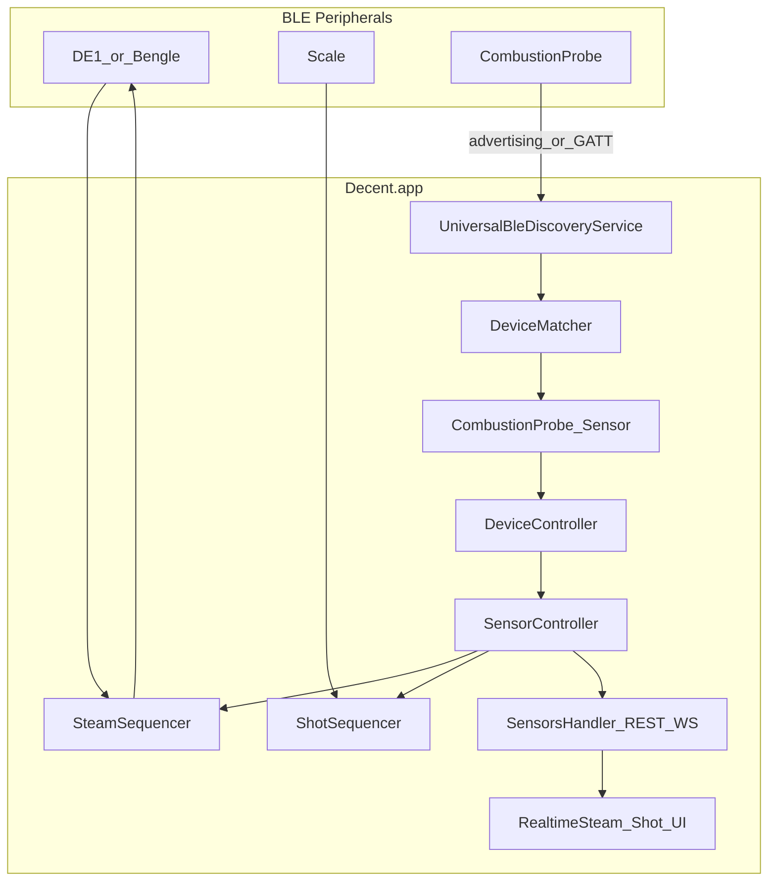

# Combustion Inc Predictive Thermometer — Decent.app Probe Integration

## Document metadata

| Field | Value |
|-------|-------|
| **Title** | Combustion Inc Predictive Thermometer — Decent.app Probe Integration |
| **Status** | Draft / Pre-implementation |
| **Location (active)** | `doc/plans/combustion-probe/PRD.md` |
| **Location (after ship)** | `doc/plans/archive/combustion-probe/PRD.md` — see [§13 Document lifecycle](#13-document-lifecycle) |
| **Engineering handoff** | [IMPLEMENTATION.md](IMPLEMENTATION.md) |
| **Phase 0 spike template** | [SPIKE-universal-ble-discovery.md](SPIKE-universal-ble-discovery.md) |

**Related research:** Best-of-n feasibility study (June 2026), three parallel Composer research runs on commit `feb1427f`.

**Related prior work:**

- [Bengle milk probe + Steam Sequencer plan](../archive/bengle-milk-probe-and-steam-sequencer/2026-05-18-bengle-milk-probe-and-steam-sequencer.md) — direct architectural predecessor
- [BLE scan refactor design](../archive/ble-scan-refactor/2026-02-23-ble-scan-refactor-design.md) — discovery constraints
- [Hot-water stop-at-weight design](../archive/hot-water-stop-at-weight/design.md) — sequencer and gateway-mode precedent
- [Shot-scale-disconnect plan](../archive/shot-scale-disconnect/2026-04-06-shot-scale-disconnect.md) — disconnect-mid-session pattern

---

## 1. Executive summary

Integrate Combustion Inc's Predictive Thermometer as an external BLE temperature probe in Decent.app (Dart package `reaprime`, user-facing name **Decent.app**).

**Primary use case:** Stop-at-temperature for milk steaming — automatically return the machine to idle when a configured probe reading reaches the target.

**Secondary use case:** Cup/liquid temperature visibility during espresso brewing, including live display via WebSocket/UI and persistence in shot records.

**Feasibility conclusion (June 2026 research):** Integration is **technically feasible**. Combustion publishes MIT-licensed BLE specifications and reference libraries (Android/iOS). Decent.app already has sensor plumbing and steam stop-at-temperature scaffolding explicitly designed for third-party probes. The main new work is a Combustion BLE driver and discovery-layer changes (manufacturer data / service UUID matching, not name-only).

---

## 2. Background and history

### 2.1 Decent.app context

Decent.app is a Flutter gateway application for Decent Espresso machines (DE1, Bengle). Primary deployment platform is the Android DE1 tablet. The app connects to machines and scales via BLE/USB, exposes REST (port 8080) and WebSocket APIs, and includes a JavaScript plugin system.

Device architecture follows transport abstraction (`BLETransport`), constructor dependency injection, and sensors as a first-class `Device` type alongside machines and scales. See [`CLAUDE.md`](../../CLAUDE.md) for full architecture.

### 2.2 Prior probe work (May 2026)

The [Bengle milk-probe + Steam Sequencer effort](../archive/bengle-milk-probe-and-steam-sequencer/2026-05-18-bengle-milk-probe-and-steam-sequencer.md) established the foundation Combustion builds on:

| Capability | Status today |
|------------|--------------|
| `SteamSettings.stopAtTemperature` (0 = off) in workflow/API | Shipped |
| `SteamSequencer` — app-side stop when sensor ≥ target | Shipped |
| `SensorController` — BLE sensors + bridge-registered adapters | Shipped |
| `SteamSnapshot.milkTemperature` per frame | Shipped |
| REST `/api/v1/steams`, sensor REST/WS | Shipped |
| Design intent: **"Bengle internal or 3rd-party"** probes | Documented |
| Bengle FW-autonomous stop (MMR stub `0x00000000`) | Stubbed — Combustion uses **app-side** path |
| Explicit `stopSourceId` / preferred probe | **Deferred** — "first registered sensor wins" |

**Today on real hardware:** No third-party probe registers in production. Setting `stopAtTemperature > 0` alone does nothing until a sensor appears in `SensorController`. The test suite exercises both stop paths via `MockBengle` and test sensors.

Combustion integration activates the existing app-side stop path without requiring Bengle firmware.

### 2.3 Combustion Inc context

Combustion Inc manufactures the Predictive Thermometer — a food-grade BLE probe with eight thermistors and firmware-computed virtual core, surface, and ambient readings.

**Open integration stack (MIT):**

| Resource | Link |
|----------|------|
| BLE spec (authoritative, **DRAFT**) | [probe_ble_specification.rst](https://github.com/combustion-inc/combustion-documentation/blob/main/probe_ble_specification.rst) |
| All device specs | [combustion-inc/combustion-documentation](https://github.com/combustion-inc/combustion-documentation) |
| Developer page | [combustion.inc/pages/developer](https://combustion.inc/pages/developer) |
| Android BLE library | [combustion-android-ble](https://github.com/combustion-inc/combustion-android-ble) — includes advertising-only `ProbeScanner` |
| iOS BLE library | [combustion-ios-ble](https://github.com/combustion-inc/combustion-ios-ble) |
| Example apps | [combustion-android-example](https://github.com/combustion-inc/combustion-android-example), [combustion-ios-example](https://github.com/combustion-inc/combustion-ios-example) |

**Protocol highlights:**

- Manufacturer ID: `0x09C7` in advertising data
- Probe Status service UUID: `00000100-CAAB-3792-3D44-97AE51C1407A`
- Temperature: 8 × 13-bit thermistors in 13-byte packed field; `°C = (raw × 0.05) − 20`
- Update paths: **advertising-only** (~250 ms) or GATT connected (Probe Status notifications + Nordic UART)
- Connection limit: probe supports max **3 simultaneous BLE connections**

There is **no official Dart/Flutter library** — implementation requires porting from the spec or Kotlin/Swift reference code.

### 2.4 Feasibility research summary (June 2026)

Three independent codebase and protocol research runs converged on:

- Protocol is complete enough to implement
- Main new work: Combustion BLE driver + **discovery-layer changes** (manufacturer data / service UUID, not name-only)
- Steam stop MVP aligns with existing `SteamSequencer`
- Brew cup temperature requires new `ShotSequencer` / `ShotSnapshot` work (greenfield)
- Recommended: **advertising-only** sensor path first (avoids probe connection-slot contention with DE1 + scale + Combustion Display/app)
- Key risks: discovery gap, BLE connection budget, multi-sensor selection, thermistor channel choice, DRAFT spec status

### 2.5 Lessons from prior Decent.app implementations

Archived plans in `doc/plans/archive/` inform this PRD and the [engineering handoff](IMPLEMENTATION.md):

**Discovery and BLE**

- [BLE scan refactor](../archive/ble-scan-refactor/2026-02-23-ble-scan-refactor-design.md): UUIDs often appear in the **scan response**, not the primary advertisement packet. Combustion discovery must inspect full scan metadata, not rely on name matching alone. Current code skips devices with empty names (`universal_ble_discovery_service.dart`).
- [Acaia scale fix](../archive/acaia-scale-fix/2025-03-25-acaia-scale-fix-design.md): Narrow name matching makes devices invisible — support multiple identification paths (name, manufacturer ID, service UUID).
- [Android ANR fix](../archive/android-anr-fix/fix-android-anr.md): BLE radio congestion during machine wake/reconnect. Advertising-only Combustion path is strongly preferred on the DE1 tablet.
- [Universal BLE migration](../archive/ble-universal-ble-migration/flutter-blue-plus-to-universal-ble-migration.md): Single BLE stack (`universal_ble`); build transport clean first.

**Probe and sensor architecture**

- [Bengle milk-probe plan](../archive/bengle-milk-probe-and-steam-sequencer/2026-05-18-bengle-milk-probe-and-steam-sequencer.md): Direct predecessor. Combustion is BLE-discovered via `SensorController` path #1; must coexist with bridge-registered Bengle milk probe. Prior deferral of `stopSourceId` is **no longer safe** with Decent Temp, DiFluid R2, Bengle, and Combustion coexisting.
- [Bengle integrated scale](../archive/bengle-integrated-scale/2026-05-05-bengle-integrated-scale.md): Reuse existing API surface (`/api/v1/sensors`); reject parallel `/api/v1/probe/*` endpoints. Document explicit sensor precedence rules.

**Stop-at-threshold sequencers**

- [Hot-water stop-at-weight](../archive/hot-water-stop-at-weight/design.md): Separate pure decision logic from I/O; gateway mode `full` disables native sequencer to avoid double-stop with skin-owned machine. `SteamSequencer` does not gate on gateway mode today — see open decision OD-6.
- [Shot-scale-disconnect](../archive/shot-scale-disconnect/2026-04-06-shot-scale-disconnect.md): `_scaleLost` pattern — when peripheral disconnects mid-session, disable stop logic, do not use stale stream values, log and continue without crash. Mandatory for steam and shot probe work.

**Testing and delivery**

- [TDD workflow design](../archive/tdd-workflow/2026-03-12-tdd-workflow-design.md): Unit → integration → E2E (`sb-dev` + scenario markdown). Write tests outside-in, implement inside-out.
- [Demo-mode simulated fallback](../archive/demo-mode/2026-05-11-simulated-device-fallback.md): Mock Combustion probe for CI and `--dart-define=simulate=1`.
- [Transport lifetime audit](../archive/transport-lifetime-audit/transport-lifetime-audit.md): If GATT added later, idempotent characteristic subscriptions required.

---

## 3. Problem statement

Users with Combustion thermometers cannot use them as temperature probes in Decent.app today.

- Stop-at-temperature steaming is scaffolded (`SteamSequencer`, `stopAtTemperature` in workflow) but **inert** without a registered sensor.
- Cup temperature during shots is not captured or displayed. `ShotSnapshot` has machine + scale + volume only. Profile-step `sensor: coffee|water` refers to DE1 internal mix temperature, not an external probe.
- Discovery rejects devices without friendly BLE names, which may exclude Combustion probes identified primarily by manufacturer data.

---

## 4. Goals and non-goals

### 4.1 Goals

1. Discover and connect Combustion Predictive Thermometer as a `Sensor` device
2. Stream temperature readings via existing sensor API (`/api/v1/sensors`, `/ws/v1/sensors/{id}/snapshot`)
3. Enable stop-at-temperature steaming when `SteamSettings.stopAtTemperature > 0` and probe reading ≥ target
4. Record probe temperature in `SteamSnapshot.milkTemperature` during steam sessions
5. Expose live probe temperature during espresso shots (WebSocket + UI)
6. Persist probe temperature in shot records (`ShotSnapshot` + DB + REST/API spec)
7. Support simulated Combustion probe for CI/dev (`--dart-define=simulate=1`)

### 4.2 Non-goals (initial release)

- Combustion Display, Gauge, Engine, or MeatNet node support
- Probe firmware updates / UART command surface beyond temperature streaming
- OEM co-branding or Combustion app partnership requirements
- Replacing Bengle internal milk probe (coexistence required)
- Profile-step exit on external probe temperature
- Using probe UART alarm messages (`0x0B`) for stop logic (app-side comparison unless product decides otherwise)

---

## 5. User stories

| ID | As a… | I want… | So that… |
|----|-------|---------|----------|
| US-1 | Barista steaming milk | steam to stop automatically when milk reaches a target temp | I don't overheat milk |
| US-2 | Barista | see live probe temp during steaming | I know when I'm approaching target |
| US-3 | Barista pulling shots | see cup/liquid temp during the pour | I understand extraction temperature |
| US-4 | Barista reviewing history | see probe temp in saved shot records | I can correlate temp with taste |
| US-5 | Skin/plugin developer | read probe temp via existing sensor WebSocket | I can build custom UIs without new API surface |
| US-6 | User with multiple sensors | designate which probe drives steam stop | the wrong device doesn't trigger stop |
| US-7 | Developer without hardware | run simulated Combustion probe | CI and local dev work without physical probe |

---

## 6. Functional requirements

### 6.1 Device discovery and connection

- **FR-D1:** System SHALL identify Combustion probes by manufacturer ID `0x09C7` and/or Probe Status service UUID `00000100-CAAB-3792-3D44-97AE51C1407A`
- **FR-D2:** System SHALL NOT require a human-friendly advertised name (serial-number names and empty-name + manufacturer-data paths MUST be supported)
- **FR-D3:** Combustion probe SHALL appear in device discovery list and `/api/v1/sensors` when in range
- **FR-D4:** `DeviceMatcher.serviceUuidsFor(DeviceType.sensor)` SHALL include Combustion service UUID for filtered scans (Android background throttling supplement)
- **FR-D5:** Primary integration mode SHALL be advertising-only temperature reads (no persistent GATT connection required for MVP)
- **FR-D6:** Optional GATT-connected mode MAY be added later; not blocking MVP

### 6.2 Temperature data model

- **FR-T1:** Sensor `data` stream SHALL emit at minimum `{ "temperature": <double Celsius> }` for `SteamSequencer` compatibility
- **FR-T2:** Sensor SHOULD expose additional channels in `SensorInfo.dataChannels` (core, surface, ambient, raw T1–T8) for advanced clients
- **FR-T3:** Product-default channel for `temperature` key MUST be configurable (see [§11 Open decisions](#11-open-product-decisions))
- **FR-T4:** Temperature encoding per Combustion spec: `°C = (raw × 0.05) − 20`

### 6.3 Steam stop-at-temperature

- **FR-S1:** When `stopAtTemperature > 0` and registered sensor `temperature ≥ target`, app SHALL call `machine.requestState(idle)` via existing `SteamSequencer._maybeAppSideStop`
- **FR-S2:** FW-autonomous Bengle stop path SHALL remain unchanged; Combustion always uses app-side path
- **FR-S3:** `SteamSnapshot.milkTemperature` SHALL reflect latest probe reading during steam recording
- **FR-S4:** Stop SHALL fire at most once per steam session
- **FR-S5:** When no sensor registered or `stopAtTemperature == 0`, stop-at-temp SHALL be inert (no user-facing error)
- **FR-S6:** When probe disconnects mid-steam, stop-at-temp SHALL disable cleanly (no stale-temp stop, no crash) — `_probeLost` pattern per [shot-scale-disconnect plan](../archive/shot-scale-disconnect/2026-04-06-shot-scale-disconnect.md)
- **FR-S7:** (Pending OD-6) When `gatewayMode == full`, native steam stop MAY be inert to avoid double-stop with skin-owned machine

### 6.4 Brew cup temperature

- **FR-B1:** Live probe temperature SHALL be available via `/ws/v1/sensors/{id}/snapshot` during shots
- **FR-B2:** `ShotSnapshot` SHALL gain optional `probeTemperature` (nullable double, Celsius)
- **FR-B3:** `ShotSequencer` SHALL subscribe to configured/preferred sensor during active shot recording
- **FR-B3a:** When probe disconnects mid-shot, recording SHALL continue with last-known temp; stop-at-weight unaffected; no crash
- **FR-B4:** Probe temperature SHALL persist in shot DB records and REST shot endpoints
- **FR-B5:** Realtime shot UI SHALL display live probe temp when sensor connected
- **FR-B6:** `assets/api/rest_v1.yml` and `doc/Api.md` SHALL be updated in same commit as schema changes

### 6.5 Multi-sensor policy

- **FR-M1:** User/settings SHALL designate preferred probe for steam stop and shot recording — **required for v1** (supersedes Bengle plan "first sensor wins" deferral)
- **FR-M2:** Bridge-registered sensors (Bengle milk probe) SHALL take precedence on `deviceId` collision per `SensorController`
- **FR-M3:** Sensor precedence documented in `doc/DeviceManagement.md`: bridge-registered > preferred setting > first registered

### 6.6 Settings and UI

- **FR-U1:** Native UI SHALL expose `stopAtTemperature` in steam workflow settings
- **FR-U2:** Settings SHALL allow selecting preferred probe when multiple sensors present
- **FR-U3:** Device discovery UI SHALL show Combustion probe with vendor/model identification

### 6.7 Simulation and testing

- **FR-X1:** Mock Combustion sensor available under simulate mode
- **FR-X2:** Unit tests cover protocol parsing, discovery matching, steam stop, shot recording with probe temp

---

## 7. Non-functional requirements

- **NFR-1:** Device implementations MUST depend on `BLETransport`, not `universal_ble` directly
- **NFR-2:** BLE operations MUST use per-device queue — probe must not block DE1/scale
- **NFR-3:** Primary validation platform: Android DE1 tablet with DE1/Bengle + scale + Combustion probe concurrently
- **NFR-4:** Stop latency acceptable for milk steaming (~250 ms advertising interval + processing); document expected behavior
- **NFR-5:** Graceful degradation when probe disconnects mid-steam or mid-shot (last known temp in records, no crash)
- **NFR-6:** Respect probe 3-connection limit — advertising-only preferred; document GATT impact

---

## 8. System context

---

## 9. Success metrics

- Combustion probe discovered and streaming within one scan cycle on DE1 tablet
- Stop-at-temp triggers within one advertising interval of crossing target (hardware validated)
- Steam records contain non-null `milkTemperature` when probe active
- Shot records contain non-null `probeTemperature` when probe active during pour
- `flutter test` green with mock Combustion sensor; no regressions in sensor/steam tests

---

## 10. Dependencies and constraints

- Combustion BLE spec is **DRAFT** — pin implementation to tested firmware version
- `universal_ble` may need enhancement for manufacturer-data in scan callbacks (Phase 0 spike)
- No Dart reference implementation — port from [combustion-android-ble ProbeScanner](https://github.com/combustion-inc/combustion-android-ble) or spec
- Combustion official app or Display may occupy probe connection slot if GATT mode used
- `ConnectionManager` orchestrates machine + scale only; sensors auto-connect via `SensorController` when discovered

---

## 11. Open product decisions

**Status: Resolved 2026-07-01** — defaults adopted for v1 implementation. See `spine-tasks/CONTEXT.md` for authoritative table.

| ID | Decision | **Resolved (v1)** |
|----|----------|-------------------|
| OD-1 | Default `temperature` channel for steam | Virtual core for milk pitcher |
| OD-2 | Default `temperature` channel for brew cup | T1 (immersed tip) |
| OD-3 | Preferred probe storage | Settings keys; optional remember-device later |
| OD-4 | Advertising-only vs GATT for MVP | Advertising-only |
| OD-5 | Shot UI placement | Realtime shot overlay + sensor WebSocket API for skins |
| OD-6 | Gateway mode steam stop | Inert when `gatewayMode == full` |

---

## 12. Phasing

Scope reference only — engineering owns scheduling. See [IMPLEMENTATION.md §13](IMPLEMENTATION.md#13-tdd-implementation-sequence) for numbered build sequence.

| Phase | Scope |
|-------|-------|
| **Phase 0** | `universal_ble` scan-metadata spike; real Combustion adv fixtures |
| **Phase 1** | Driver, discovery fix, simulate support, preferred-probe setting, steam stop + recording, probe-disconnect safety, E2E scenario |
| **Phase 2** | Live brew temp via sensor WS (document for skin devs once Phase 1 ships) |
| **Phase 3** | Shot persistence, `ShotSequencer` wiring, shot UI, API spec, native steam settings UI |

---

## 13. Document lifecycle

Per [`CONTRIBUTING.md`](../../CONTRIBUTING.md) and [`CLAUDE.md`](../../CLAUDE.md) pre-merge guardrails.

**When Combustion probe integration is considered done** (feature merged to `main`, acceptance criteria in [IMPLEMENTATION.md §14](IMPLEMENTATION.md#14-acceptance-criteria) met):

1. **Move this PRD** from `doc/plans/combustion-probe/PRD.md` → **`doc/plans/archive/combustion-probe/PRD.md`**
   - Create subfolder `doc/plans/archive/combustion-probe/` if needed (same pattern as `bengle-milk-probe-and-steam-sequencer/`).
   - Update status to **Archived / Shipped** and note merge commit or release version.
   - Remove empty `doc/plans/combustion-probe/` directory if no other active docs remain.

2. **Companion docs:**
   - **`IMPLEMENTATION.md`** — delete once shipped (commit chain is authoritative), unless archived alongside PRD for historical context.
   - **`SPIKE-universal-ble-discovery.md`** — archive in `doc/plans/archive/combustion-probe/` if findings are durable; delete if superseded by code/tests.

3. **Do not archive before merge** — keep PRD in `doc/plans/combustion-probe/` while implementation is in progress.

This archiving step is a **required pre-merge checklist item**, not optional cleanup.
