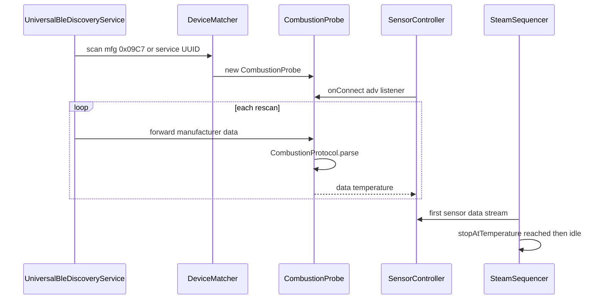
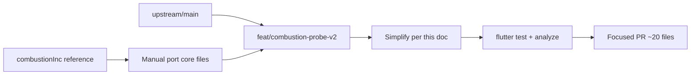

# Combustion Inc Probe — Reimplementation v2 Handoff

Authoritative engineering handoff for the v2 Combustion Predictive Thermometer integration. Supersedes v1 implementation scope in [PRD.md](PRD.md) and [IMPLEMENTATION.md](IMPLEMENTATION.md).

## Document metadata

| Field | Value |
|-------|-------|
| **Status** | Active / Authoritative for v2 work |
| **Supersedes** | v1 PRD implementation scope (product vision in PRD remains valid) |
| **Branch strategy** | Fresh from `upstream/main` — do **not** iterate `combustionInc` wholesale |
| **Related PR** | [#404](https://github.com/tadelv/reaprime/pull/404) (WIP, v1 approach) |
| **Related issue** | [#403](https://github.com/tadelv/reaprime/issues/403) |
| **Maintainer guidance** | [PR #404 comment](https://github.com/tadelv/reaprime/pull/404#issuecomment-4896713589) |
| **Agent integration guide** | [doc/agents/sensor-integration.md](../../agents/sensor-integration.md) |
| **v1 docs (historical)** | [PRD.md](PRD.md) · [IMPLEMENTATION.md](IMPLEMENTATION.md) · [SPIKE](SPIKE-universal-ble-discovery.md) · [HARDWARE-VALIDATION](HARDWARE-VALIDATION.md) |

---

## 1. Executive summary

PR #404 (`combustionInc`) over-built a parallel feature stack (~544 files, +37,649 / −9,406 lines) when maintainer guidance requires a **DecentTemp-shaped sensor driver**, a **device matcher** entry, and verification that **`Workflow.SteamSettings.stopAtTemperature`** round-trips on `/api/v1/workflow`.

On `upstream/main`, `SteamSequencer` already subscribes to the first registered sensor's `data['temperature']` and calls `requestState(idle)` when the workflow target is reached. **No controller changes are required** for steam stop-at-temperature.

The v2 reimplementation is a ~500 LOC device-layer delta across ~15–20 files, executed as **5 focused tasks** — not 18 pi-spine packets.

---

## 2. Maintainer guidance (authoritative)

From [tadelv's PR #404 comment](https://github.com/tadelv/reaprime/pull/404#issuecomment-4896713589):

> implement combustionInc as a sensor, exposing temperature, like [decent/temperature](https://github.com/tadelv/reaprime/blob/a572302e20d5a0d5b52aaa343f61c9fb4ec2557e/lib/src/models/device/impl/decent_temp/temperature.dart) also add it in [device matcher](https://github.com/tadelv/reaprime/commit/4b00f6a2f306972bee1719c6cb810bb3985e284f) make sure to update Workflow.SteamSettings.stopAtTemperature field on the /api/v1/workflow endpoint. The rest is taken care of by [steam sequencer](https://github.com/tadelv/reaprime/blob/a572302e20d5a0d5b52aaa343f61c9fb4ec2557e/lib/src/controllers/steam_sequencer.dart) automatically already - it scans for sensors that expose temperature field and uses those readings to stop steam when target temperature is about to be reached

### Interpretation

| # | Requirement | Action on v2 |
|---|-------------|-------------|
| 1 | Sensor like `DecentTemp` | Implement `CombustionProbe implements Sensor`; `data` stream emits `{temperature: <double>}` |
| 2 | Device matcher | Add Combustion to `serviceUuidsFor(DeviceType.sensor)` + match rule (commit `4b00f6a` pattern) |
| 3 | Workflow API | `stopAtTemperature` on `/api/v1/workflow` — **already exists on main**; add/verify test only |
| 4 | Steam stop | **Do not modify** `SteamSequencer` — existing `_trackFirstSensor()` + `_maybeAppSideStop()` suffice |

### Explicitly out of scope for v2 merge

Unless maintainer requests later:

- Preferred-probe settings (`preferredSteamProbeId`, `resolvePreferred`) — SP-007
- Shot `probeTemperature` persistence, REST, realtime UI — SP-013–SP-016
- Native steam settings UI / probe picker — SP-017
- `SteamSequencer` / `ShotSequencer` / `De1StateManager` rewrites — SP-008, SP-014
- pi-spine orchestration artifacts (`spine-tasks/`, `.spine/`, `.pi/`)

---

## 3. Audit findings (consolidated)

Five parallel best-of-n research runs (July 2026) reached unanimous conclusions on architecture. Root causes of the v1 failure:

1. **Ignored existing scaffolding** — `SensorController`, `SensorsHandler`, and `SteamSequencer` on main already implement discovery, REST/WS exposure, and app-side stop-at-temperature.
2. **Wrong template** — v1 introduced `CombustionAdvertisingTransport` on `UniversalBleTransport`, preferred-probe policy, and controller plumbing instead of a thin sensor driver.
3. **18 spine tasks drove scope creep** — SP-008 through SP-018 expanded into shot persistence, UI, docs batches, and hardware protocols not in maintainer guidance.
4. **Layering violation** — device-specific interface implemented on generic BLE transport; violates transport-boundary rules in `CLAUDE.md`.
5. **Unmergeable diff noise** — repo-wide formatting, 41 added `.cursor/rules/*.mdc`, iOS signing churn, coverage blobs, and draft PR files.

### Spine task verdict matrix

| Tasks | Verdict | Rationale |
|-------|---------|-----------|
| SP-001–002 | Keep concept | Protocol parser + hex fixtures |
| SP-003–004 | Keep | Empty-name probe discovery + advertising forwarding |
| SP-005–006 | Keep, simplify | Sensor driver + mock simulate |
| SP-007 | Delete | Preferred probe not requested |
| SP-008 | Delete | Steam stop already on `upstream/main` |
| SP-009–010 | Keep one integration test | Drop spine packaging |
| SP-011–012 | Defer | Optional `DeviceManagement.md` note only |
| SP-013–018 | Delete / defer | Shot/UI/docs/hardware protocol artifacts |

---

## 4. Correct architecture

### Data flow (target)



### Reference: `SteamSequencer` on `upstream/main` (do not change)

```dart
void _trackFirstSensor() {
  // picks first sensor in SensorController
  _sensorSub = sensor.data.listen((payload) {
    final raw = payload['temperature'];
    if (raw is num) _latestSensorTemperature = raw.toDouble();
  });
}

void _maybeAppSideStop(MachineSnapshot s) {
  final target = wf.steamSettings.stopAtTemperature;
  if (target <= 0) return;
  // when temp >= target → machine.requestState(idle)
}
```

Files: [`lib/src/controllers/steam_sequencer.dart`](../../lib/src/controllers/steam_sequencer.dart) on `upstream/main`.

### Reference: `DecentTemp` template

[`lib/src/models/device/impl/decent_temp/temperature.dart`](../../lib/src/models/device/impl/decent_temp/temperature.dart) — GATT connect → subscribe → parse → emit `{temperature}`. Combustion differs only in **data source** (BLE advertising, not GATT).

### File-by-file plan (clean v2 PR only)

| Layer | Files | Action |
|-------|-------|--------|
| Protocol | `combustion_constants.dart`, `combustion_protocol.dart`, fixtures, parser tests | Port; keep pure Dart |
| Sensor | `combustion_probe.dart`, `mock_combustion_probe.dart`, probe tests | Rewrite slimmer; emit `{temperature}` only for v1 |
| Discovery | `device_matcher.dart`, `universal_ble_discovery_service.dart`, `universal_ble_transport.dart` | Minimal adv forwarding; **no Combustion import in transport** |
| Simulate | `simulated_device_service.dart` | Wire `MockCombustionProbe` for `simulate=sensor` |
| Controllers | `steam_sequencer.dart`, `shot_sequencer.dart`, `de1_state_manager.dart`, `sensor_controller.dart` | **No changes** |
| API | `workflow.dart`, `workflow_handler.dart`, `rest_v1.yml` | Verify round-trip; add test if missing |

### Combustion-specific deviations (unavoidable, not over-engineering)

| Deviation | Why |
|-----------|-----|
| Advertising-only (no GATT subscribe) | Combustion MVP path; requires discovery rescan forwarding |
| Empty BLE name | Probes often advertise without name; mfg ID `0x09C7` metadata matcher required |
| Virtual core → `temperature` key | `SteamSequencer` reads `payload['temperature']` only |

---

## 5. Salvage inventory (port from `combustionInc`)

Core device-layer delta on `combustionInc` vs `upstream/main`: **~1,581 lines across 16 files** (protocol, sensor, discovery, tests, fixtures). Use as reference; simplify per this doc.

| Path | Notes |
|------|-------|
| `lib/src/models/device/impl/combustion/` | All 4 files — simplify `combustion_probe.dart` |
| `test/fixtures/combustion/` | Hex fixtures + README (spec-derived until hardware capture) |
| `test/models/device/impl/combustion/` | Unit tests |
| `test/integration/combustion_steam_stop_integration_test.dart` | Simplify to main's `SteamSequencer` constructor |
| `lib/src/services/device_matcher.dart` | Port metadata match; drop over-abstraction if possible |
| `lib/src/services/universal_ble_discovery_service.dart` | Port adv forwarding only |
| `lib/src/services/ble/universal_ble_transport.dart` | Generic mfg data stream; remove `CombustionAdvertisingTransport` |
| `lib/src/services/simulated_device_service.dart` | Mock wiring |

Optional (not required for merge): `.agents/skills/decent-app/scenarios/combustion-probe-steam-stop.md` — sb-dev smoke recipe.

---

## 6. Implementation tasks (5 tasks, not 18)

Follow [TDD workflow](../../../.claude/skills/tdd-workflow/SKILL.md). **No pi-spine batch for v2.**

| # | Task | Scope | Verify |
|---|------|-------|--------|
| **T1** | Protocol + fixtures | `combustion_protocol.dart`, constants, hex fixtures | `flutter test test/models/device/impl/combustion/combustion_protocol_test.dart` |
| **T2** | Slim sensor + mock + simulate | `combustion_probe.dart`, `mock_combustion_probe.dart`, simulate wiring | `flutter test test/models/device/impl/combustion/combustion_probe_test.dart` |
| **T3** | Matcher + discovery adv forwarding | `device_matcher.dart`, discovery service, transport | matcher + discovery service tests |
| **T4** | Workflow API verification | `workflow_handler_test.dart` — `stopAtTemperature` round-trip | `flutter test test/webserver/workflow_handler_test.dart` |
| **T5** | Integration + hardware | integration test; manual DE1 checklist in PR description | `flutter test test/integration/combustion_steam_stop_integration_test.dart` |

### Branch workflow



Steps:

1. `git checkout -b feat/combustion-probe-v2 upstream/main`
2. Port core files from `combustionInc` (§5), applying simplifications
3. Land agent guidance (§12) in same PR
4. Run `flutter test` + `flutter analyze`
5. Open PR with explicit deleted-scope list and maintainer three-point checklist
6. Do **not** merge `combustionInc` wholesale

---

## 7. Testing strategy

| Tier | What | How |
|------|------|-----|
| **Unit** | `CombustionProtocol` | Hex fixtures in `test/fixtures/combustion/` |
| **Unit** | `CombustionProbe` | Mock adv feed → `data` emits `temperature` |
| **Unit** | `DeviceMatcher` | Name, mfg ID `0x09C7`, service UUID, negatives |
| **Unit** | Discovery adv forwarding | `processScannedDeviceForTesting` hook |
| **Integration** | Steam stop at target | `MockCombustionProbe` + main `SteamSequencer` |
| **Simulate** | App-level | `flutter run --dart-define=simulate=sensor,machine` |
| **E2E smoke** | Optional | sb-dev + `curl` workflow PUT + sensor WS |
| **Hardware** | Manual | DE1 tablet + physical probe; replace synthetic fixtures |

Synthetic fixtures are spec-derived until live capture during T5 hardware validation.

---

## 8. Repo cleanup checklist

### Phase A — Do not ship (delete or never cherry-pick)

| Path | Reason |
|------|--------|
| `spine-tasks/` (~55 files) | pi-spine orchestration artifacts |
| `.spine/spine-config.json` | spine runtime config |
| `.pi/loops/` | loop artifacts |
| `scripts/spine-worktree-setup.sh` | spine-only helper |
| `coverage/lcov.info` | generated |
| `pr_body.md`, `issue_body.md` | draft PR/issue text |
| `docs/constitution.md` | not project docs |
| 41 added `.cursor/rules/*.mdc` | AI cruft — not on `upstream/main` |

### Phase B — Revert over-scoped application code

Present on `combustionInc`, absent from v2 PR:

- `SensorController.resolvePreferred()` + `preferredSteamProbeId` / `preferredShotProbeId` settings
- `SteamSequencer` preferred-probe / `_probeLost` / gateway-mode gates
- `ShotSequencer` probe subscription + `ShotSnapshot.probeTemperature` + Drift migration
- `steam_workflow_settings_page.dart`, steam form probe picker
- Shot REST/OpenAPI `probeTemperature`
- Realtime shot probe UI
- Unrelated settings UI refactors (`plugins_settings_view.dart`, etc.)
- iOS signing/Podfile churn (land separately if needed)

### Phase C — Revert formatting noise

~350+ files with `dart format` only changes — excluded by branching from `upstream/main` and surgical cherry-pick.

### `doc/DeviceManagement.md` note

The Combustion section on `combustionInc` may describe v1 over-scoped behavior (`resolvePreferred`, `preferredSteamProbeId`). On the v2 branch, align with maintainer model: **first registered sensor** (bridge wins on `deviceId` collision), matching `upstream/main`.

---

## 9. API surface (maintainer scope only)

| Endpoint / field | Status on `upstream/main` | v2 action |
|------------------|---------------------------|-----------|
| `PUT /api/v1/workflow` → `steamSettings.stopAtTemperature` | Exists in model + OpenAPI | Verify test |
| `GET /api/v1/workflow` | Returns `stopAtTemperature` | No change |
| `GET /api/v1/sensors` | Lists discovered sensors | Works when probe registers |
| `GET /ws/v1/sensors/{id}/snapshot` | Live temperature stream | Works automatically |

**Do not add for v2:** shot `probeTemperature`, preferred-probe settings API, new combustion-specific routes.

Example client usage (works on main once sensor registers):

```bash
curl -X PUT http://localhost:8080/api/v1/workflow \
  -H 'Content-Type: application/json' \
  -d '{"steamSettings":{"stopAtTemperature":65.0}}'
```

`0` disables stop-at-temperature.

---

## 10. Open questions for maintainer

Resolve before Phase 2 scope expansion:

1. **First-sensor vs preferred-probe** — With Bengle milk probe + Combustion both present, is first-registered acceptable for v1?
2. **Virtual core vs T1** — Map virtual core to `temperature` for milk steaming; confirm with real hardware.
3. **GATT fallback** — Is advertising-only sufficient, or should Probe Status GATT subscribe be a follow-up?
4. **Native steam UI** — Is API-only `stopAtTemperature` enough, or is a settings page expected?
5. **iOS BLE permission fix** — Cherry-pick from `combustionInc` separately from Combustion feature?

---

## 11. v1 document handling

v1 docs remain in place for historical context. Each has a superseded banner pointing here. Archive to `doc/plans/archive/combustion-probe/` at PR merge per `CLAUDE.md` workflow.

---

## 12. Agent guidance to land with v2 PR

Maintainer feedback generalizes beyond Combustion. Future agents integrating BLE temperature sensors must not repeat v1 mistakes. Durable guidance lives in `CLAUDE.md` + `doc/agents/`, not only in this plan.

Combustion v2 is the **canonical worked example** of the sensor-integration pattern.

### Files to update (same PR as v2 implementation)

| File | Change |
|------|--------|
| [`doc/agents/sensor-integration.md`](../../agents/sensor-integration.md) | New reference: maintainer rules, scaffolding map, anti-patterns |
| [`CLAUDE.md`](../../../CLAUDE.md) | Common Workflows → "Adding a BLE temperature sensor" |
| [`AGENTS.md`](../../../AGENTS.md) | File Locations row + Use-as-is pointer |
| [`doc/agents/domain.md`](../../agents/domain.md) | Index entry for sensor-integration.md |

Do **not** duplicate full rules in `AGENTS.md` — it forwards to `CLAUDE.md` per project convention.

### PR checklist (maintainer three-point)

- [ ] `CombustionProbe` emits `temperature` on `data` (DecentTemp-shaped)
- [ ] Registered in `device_matcher.dart`
- [ ] `PUT /api/v1/workflow` round-trips `steamSettings.stopAtTemperature`
- [ ] No `SteamSequencer` / `ShotSequencer` / `De1StateManager` changes
- [ ] No spine/pi/coverage/cursor-rules cruft in diff
- [ ] Agent guidance files landed (§12 table)
- [ ] `flutter test` + `flutter analyze` pass
